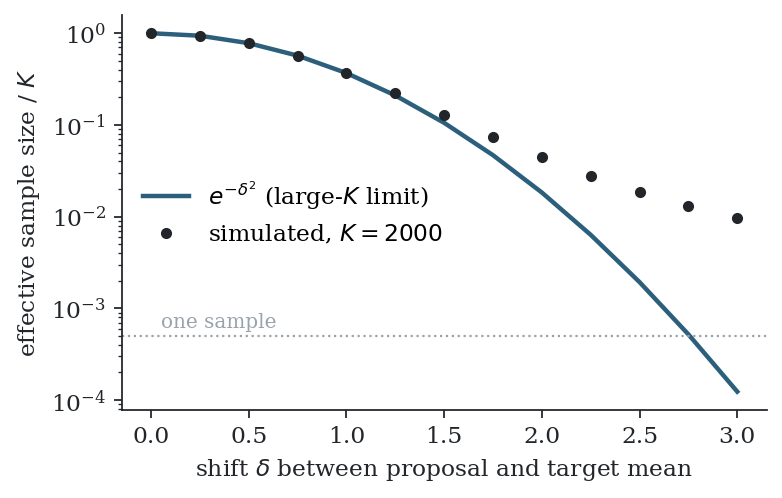

# 4. Monte Carlo and importance sampling

MPPI computes its control as an average over random simulations. This chapter covers how averages over random draws estimate expectations, how accurate they are, and how to estimate an expectation under one distribution using draws from another. The last technique, importance sampling, is the mechanism of the MPPI update.

## 4.1 Monte Carlo estimation

Let $X$ be a random variable with density $p$ and let $f$ be a function. The expectation

$$
\mu = \mathbb{E}_p[f(X)] = \int f(x)  p(x)  dx
$$

can be estimated from independent draws $X_1, \dots, X_K$ from $p$ by the sample average

$$
\hat\mu_K = \frac{1}{K} \sum_{k=1}^{K} f(X_k).
$$

The estimator is unbiased, $\mathbb{E}[\hat\mu_K] = \mu$, and by the law of large numbers it converges to $\mu$. Its variance is $\operatorname{Var}(f(X))/K$, so the typical error is

$$
\hat\mu_K - \mu  \approx  \frac{\sigma_f}{\sqrt{K}}, \qquad \sigma_f^2 = \operatorname{Var}_p(f(X)) .
$$

Two features of this rate recur throughout the book. The error falls slowly: one more digit of accuracy costs a hundred times more samples. And the rate $K^{-1/2}$ does not depend on the dimension of $X$, which is why Monte Carlo is used for high-dimensional integrals. The dimension enters only through the constant $\sigma_f$, and Section 4.4 shows that this constant can be very large.

## 4.2 Importance sampling

Suppose we want $\mathbb{E}_p[f(X)]$ but can only draw from a different density $q$, called the proposal. If $q(x) \gt 0$ wherever $f(x)p(x) \neq 0$, then

$$
\mathbb{E}_p[f(X)] = \int f(x)  \frac{p(x)}{q(x)}  q(x)  dx = \mathbb{E}_q\bigl[ f(X)  w(X) \bigr], \qquad w(x) = \frac{p(x)}{q(x)} .
$$

The function $w$ is the likelihood ratio, or importance weight. The identity says: draw from $q$, and correct for having drawn from the wrong distribution by weighting each draw by how much more (or less) likely it is under $p$ than under $q$. The estimator is

$$
\hat\mu_K = \frac{1}{K} \sum_{k=1}^{K} w(X_k)  f(X_k), \qquad X_k \sim q .
$$

It is unbiased, with variance $\operatorname{Var}_q(wf)/K$.

**Gaussian example.** Let $p = \mathcal{N}(0, \Sigma)$ and $q = \mathcal{N}(u, \Sigma)$, the same Gaussian shifted by $u$. Then

$$
w(x) = \frac{p(x)}{q(x)} = \exp\Bigl( -\tfrac12 x^\top \Sigma^{-1} x + \tfrac12 (x-u)^\top \Sigma^{-1} (x-u) \Bigr)
= \exp\Bigl( -u^\top \Sigma^{-1} x + \tfrac12 u^\top \Sigma^{-1} u \Bigr).
$$

This formula reappears in Chapter 8, where $p$ is the distribution of pure noise and $q$ is the distribution of noise added to the current control sequence.

## 4.3 Self-normalised importance sampling

Often the target density is known only up to a constant: $p(x) = \tilde p(x)/Z$ with $Z = \int \tilde p$ unknown. This is the situation in MPPI, where the target is proportional to $\exp(-\text{cost}/\lambda)$ and the normalising constant is itself an intractable integral. Write $\tilde w = \tilde p / q$. Since $\mathbb{E}_q[\tilde w] = Z$,

$$
\mathbb{E}_p[f] = \frac{\mathbb{E}_q[\tilde w f]}{\mathbb{E}_q[\tilde w]} ,
$$

and estimating numerator and denominator from the same draws gives the self-normalised estimator

$$
\hat\mu_K = \sum_{k=1}^{K} w_k  f(X_k), \qquad w_k = \frac{\tilde w(X_k)}{\sum_{j=1}^{K} \tilde w(X_j)} .
$$

The normalised weights $w_k$ are positive and sum to one, so the estimate is a weighted average of the values $f(X_k)$. Three properties follow from its being a ratio of two estimates (Owen, Chapter 9):

- It is **consistent**: it converges to $\mu$ as $K \to \infty$.
- It is **biased** for finite $K$, with bias of order $1/K$.
- Its variance is approximately $\dfrac{1}{K}  \dfrac{\mathbb{E}_q[\tilde w^2 (f - \mu)^2]}{(\mathbb{E}_q[\tilde w])^2}$ for large $K$.

The MPPI update $u_t \leftarrow u_t + \sum_k w_k  \varepsilon_t^k$ is a self-normalised importance sampling estimate with $f$ equal to the noise.

## 4.4 Effective sample size and weight degeneracy

When $q$ is a poor match for $p$, a few draws land where $p$ is large and receive almost all of the weight, and the rest contribute nothing. The estimate then behaves as if it were based on far fewer than $K$ samples. The standard diagnostic (Kong, 1992) is the effective sample size

$$
K_{\mathrm{eff}} = \frac{1}{\sum_{k=1}^{K} w_k^2} .
$$

It equals $K$ when all weights are equal and $1$ when a single weight is one and the rest are zero. For large $K$,

$$
\frac{K_{\mathrm{eff}}}{K} \approx \frac{(\mathbb{E}_q[\tilde w])^2}{\mathbb{E}_q[\tilde w^2]} .
$$

For the shifted Gaussian pair of Section 4.2 with $\Sigma = I$ and shift $\delta = \lVert u \rVert$, a direct calculation gives $\mathbb{E}_q[w^2] = e^{\delta^2}$, so

$$
\frac{K_{\mathrm{eff}}}{K} \approx e^{-\delta^2} .
$$

The fraction of useful samples falls off as a Gaussian in the distance between proposal and target, measured in standard deviations. At a shift of two standard deviations fewer than 2% of the samples are effective; at three, about one in eight thousand.

*Effective sample size for target $\mathcal{N}(0,1)$ and proposal $\mathcal{N}(\delta,1)$. The line is the large-$K$ formula; the dots are simulations with $K = 2000$ (`code/importance_sampling.py`).*

The figure also shows a trap. For large shifts the simulated value sits well above the formula. The measured $K_{\mathrm{eff}}$ cannot go below one sample, and when the weights have collapsed it overstates how well the target is covered. A healthy reading of the diagnostic is good news; a reading near one means the estimate is essentially the single best sample, whatever the formula says.

In several dimensions the effect compounds. If proposal and target are mismatched independently in each of $d$ coordinates, the ratios $(\mathbb{E}_q[\tilde w])^2 / \mathbb{E}_q[\tilde w^2]$ multiply, so the effective fraction decays exponentially in $d$. In MPPI, $d$ is the horizon times the control dimension. This is the main practical limit of the method, and most of the tuning advice in Chapter 11 is about staying away from it.

## 4.5 Summary

- A sample average estimates an expectation with error of order $K^{-1/2}$.
- Importance sampling estimates an expectation under $p$ from draws under $q$ by weighting with $p/q$.
- If $p$ is known only up to a constant, normalise the weights to sum to one; the estimate becomes a weighted average, consistent but slightly biased.
- The effective sample size $1/\sum_k w_k^2$ measures how many samples carry the estimate. It collapses when the proposal is far from the target, and the collapse worsens exponentially with dimension.
