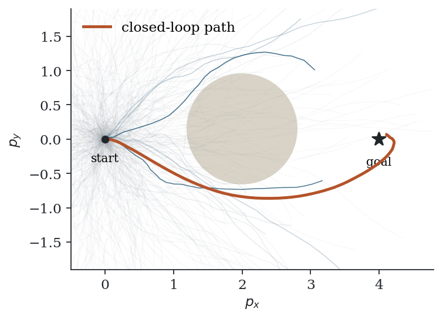
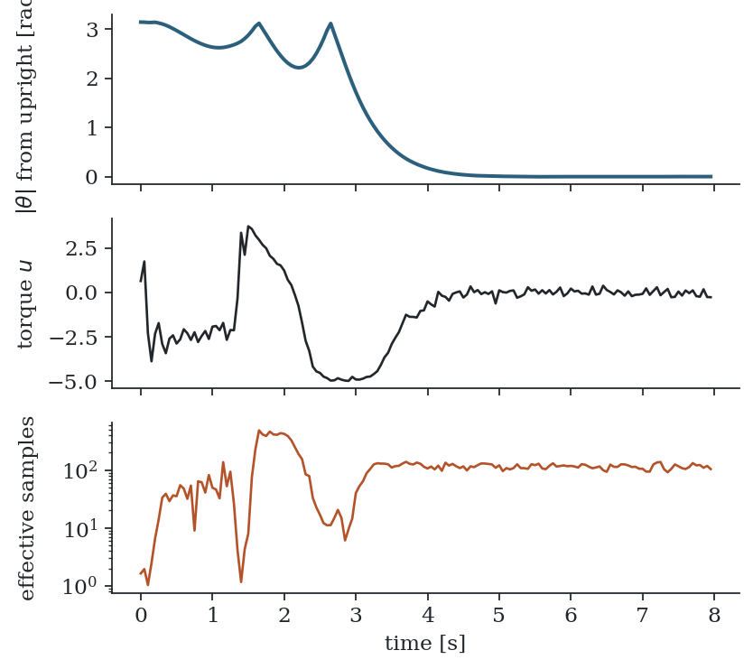

# 9. The MPPI algorithm

Chapter 8 produced an update law for a control sequence. Chapter 3 described the loop in which a control sequence is repeatedly improved, applied and shifted. Putting the two together gives the algorithm.

## 9.1 The algorithm

```text
Given    model F, running cost q, terminal cost phi
         horizon T, number of samples K, noise covariance Sigma, temperature lambda
Keep     nominal sequence U = (u_0, ..., u_{T-1}), initially zero

At every control step:
  1.  x_0 <- current state
  2.  for k = 1, ..., K  (in parallel):
  3.      draw eps_t^k ~ N(0, Sigma) for t = 0, ..., T-1
  4.      x <- x_0,  S_k <- 0
  5.      for t = 0, ..., T-1:
  6.          x   <- F(x, u_t + eps_t^k)
  7.          S_k <- S_k + q(x) + lambda * u_t' Sigma^{-1} eps_t^k
  8.      S_k <- S_k + phi(x)
  9.  beta <- min_k S_k
 10.  w_k  <- exp(-(S_k - beta)/lambda) / sum_j exp(-(S_j - beta)/lambda)
 11.  u_t  <- u_t + sum_k w_k eps_t^k          for t = 0, ..., T-1
 12.  apply u_0 to the system
 13.  shift: u_t <- u_{t+1} for t = 0, ..., T-2;  set u_{T-1} to an initial value
```

This is, up to details discussed in Section 9.5, Algorithm 2 of Williams et al. (2018).

## 9.2 Line by line

**Lines 2 to 8, the rollouts.** Each of the $K$ samples is one simulation of the model over the horizon under the nominal controls plus noise. The cost accumulated in line 7 has two parts: the state cost $q(x)$, and the term $\lambda  u_t^\top \Sigma^{-1} \varepsilon_t^k$ from the likelihood ratio of Section 8.5, which acts as a control penalty.

**Line 9, the baseline.** Subtracting the smallest cost before exponentiating does not change the normalised weights, because the factor $e^{\beta/\lambda}$ cancels between numerator and denominator. It matters numerically: costs of a few thousand divided by a temperature of order one would underflow to zero for every sample. After the subtraction the best sample has unnormalised weight exactly one.

**Line 10, the weights.** These are the self-normalised importance weights. They are positive and sum to one. A sample whose cost exceeds the best by $\lambda$ receives $e^{-1} \approx 0.37$ of the best sample's weight; one that exceeds it by $5\lambda$ receives less than 1%. The temperature is therefore the scale on which cost differences are judged to matter.

**Line 11, the update.** Each control in the sequence moves by the weighted average of the noise that was applied at that time step. The same weights are used for all time steps, because a weight belongs to a whole trajectory.

**Lines 12 and 13, the receding horizon.** Only the first control is applied. The remainder, shifted by one step, is the nominal sequence around which the next step samples.

## 9.3 Computational cost

One control step requires $K \times T$ evaluations of the model and of the running cost, and $K$ evaluations of the terminal cost. The $K$ rollouts are independent of each other, so they can run simultaneously. On a graphics processor with thousands of rollouts in parallel, the time for a control step is close to the time for a single rollout. This is what made the method practical: the first demonstrations ran several thousand rollouts of a vehicle model at tens of control steps per second (Williams et al., 2016).

The time steps within a rollout are sequential, since each state depends on the previous one. The horizon $T$ therefore sets the latency, and $K$ sets the memory.

## 9.4 What the samples look like



*One MPPI step for a point mass that must reach a goal behind a circular obstacle (`code/point_mass.py`). Thin lines are sampled rollouts from the start; the darker, bluer lines carry more weight. The thick line is the path the closed loop eventually follows.*

The figure shows the first control step for a planar point mass with acceleration inputs, $K = 1000$, $T = 30$. The nominal sequence is zero, so the rollouts spread in all directions. Those that pass through the obstacle incur a large penalty and get negligible weight. Those that go around and approach the goal get most of it. In this run the effective sample size at the first step was 23 out of 1000.

## 9.5 Details in published versions

Implementations differ in a few respects from the listing above.

**Control limits.** Limits are usually enforced by clipping $u_t + \varepsilon_t^k$ to the admissible set before it enters the model, which amounts to treating the saturation as part of the dynamics. The reference code in this book also replaces $\varepsilon_t^k$ by the noise that was actually applied after clipping.

**Smoothing.** The weighted average of independent noise sequences is itself noisy from one time step to the next. Williams et al. smooth the updated control sequence along the time axis with a Savitzky–Golay filter before applying it. Chapter 13 lists alternatives that build smoothness into the sampling.

**Exploration samples.** The published algorithm draws a fraction of the rollouts around zero control instead of around the nominal sequence, and scales the control-cost term accordingly. This guards against the nominal sequence becoming trapped.

**The tail of the sequence.** After the shift, the last control has to be initialised. Zero is the simplest choice; repeating the previous last control or using a simple stabilising feedback law are common.

**More than one update per step.** Lines 2 to 11 can be repeated several times before applying the control, each time sampling around the improved sequence. One iteration per step is the usual choice, with warm starting doing the rest.

## 9.6 The pendulum



*Swing-up of the pendulum of Section 1.5 with $K = 1000$, $T = 25$ steps of 0.05 s, $\lambda = 1$, noise variance 4, torque limit 5 (`code/pendulum.py`). Top: distance of the angle from upright. Middle: applied torque. Bottom: effective sample size.*

The controller swings the pendulum to one side, back through the bottom, and up, then holds it. The torque limit of 5 is about half of what would be needed to lift the pendulum statically, so the swing is necessary and the controller finds it without being told. The effective sample size varies by two orders of magnitude over the run. It is lowest during the swing, when the outcome is most sensitive to the controls, and settles near 100 while balancing. The small ripple in the torque during balancing is the Monte Carlo error of the update, visible because no smoothing is applied.

## 9.7 Summary

- MPPI is one importance-sampling update of the nominal control sequence per control step, inside a receding-horizon loop with warm starting.
- Its cost is $K \times T$ model evaluations per step, with the $K$ rollouts parallel.
- Subtracting the minimum cost is for numerical stability and does not change the weights.
- Practical versions add clipping for control limits and some form of smoothing.
