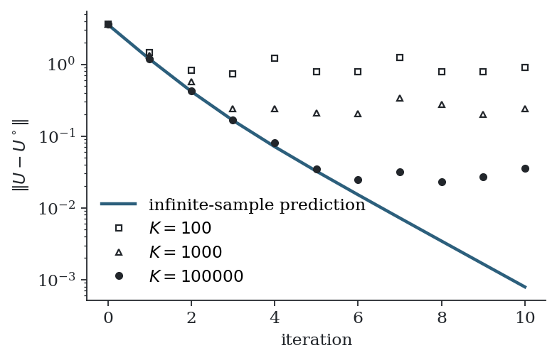

# 10. A worked example: the linear-quadratic problem

For linear dynamics and quadratic cost, every object in the derivation of Chapter 8 is Gaussian and can be written down. This gives a setting in which to check the theory against exact answers, to see what finitely many samples cost, and to compare the two common ways of handling the control cost. The numbers in this chapter come from `code/lq_example.py`.

## 10.1 The problem in stacked form

Let $x_{t+1} = A x_t + B v_t$ with quadratic state costs. The states are linear in the stacked input $V = (v_0, \dots, v_{T-1})$, so the state cost is a quadratic function of $V$:

$$
S(V) = \tfrac12 V^\top M V + b^\top V + c ,
$$

with $M$ positive semidefinite, and $b$ depending linearly on the initial state $x_0$. Let $\bar\Sigma = I_T \otimes \Sigma$ denote the covariance of the stacked noise.

## 10.2 The optimal distribution is Gaussian

The optimal distribution of Section 8.3 is

$$
q^{\star}(V)  \propto  \exp\Bigl( -\frac{1}{\lambda} \bigl( \tfrac12 V^\top M V + b^\top V \bigr) \Bigr)  \exp\Bigl( -\tfrac12 V^\top \bar\Sigma^{-1} V \Bigr).
$$

The exponent is quadratic in $V$, so $\mathbb{Q}^{\star}$ is Gaussian. Completing the square,

$$
\mathbb{Q}^{\star} = \mathcal{N}\bigl( U^{\circ},   \Sigma^{\star} \bigr), \qquad
\Sigma^{\star} = \Bigl( \bar\Sigma^{-1} + \tfrac{1}{\lambda} M \Bigr)^{-1}, \qquad
U^{\circ} = -\bigl( M + \lambda \bar\Sigma^{-1} \bigr)^{-1} b .
$$

Two observations follow.

**The mean is the solution of the regularised deterministic problem.** $U^{\circ}$ is the minimiser of

$$
S(U) + \tfrac{\lambda}{2}  U^\top \bar\Sigma^{-1} U ,
$$

the deterministic optimal control problem with control weight $R = \lambda \Sigma^{-1}$. This agrees with certainty equivalence (Section 2.4): for a quadratic $S$, $\mathbb{E}_{\mathbb{Q}_U}[S(V)] = S(U) + \tfrac12 \operatorname{tr}(M \bar\Sigma)$, so the stochastic objective of Section 8.2 differs from the deterministic one by a constant. In the linear-quadratic case the MPPI target $\mathbb{E}_{\mathbb{Q}^{\star}}[V]$ is therefore exactly the optimal open-loop sequence.

**The covariance is smaller than the sampling covariance.** $\Sigma^{\star} \preceq \bar\Sigma$, and much smaller in directions where the cost curvature $M/\lambda$ is large. The samples are drawn with covariance $\bar\Sigma$ but the distribution they are meant to represent is narrower. This mismatch, not the location of the mean, is what limits the effective sample size.

## 10.3 One iteration reaches the optimum, in the limit

With the weights of Section 8.6, the infinite-sample update returns $\mathbb{E}_{\mathbb{Q}^{\star}}[V] = U^{\circ}$ from any starting sequence, in one iteration. With $K$ samples it returns $U^{\circ}$ plus an error. For a double integrator with $T = 8$, $\lambda = 1$, $\Sigma = 4$ and starting from $U = 0$, the distance to $U^{\circ}$ after one iteration, averaged over 50 repetitions, was:

| $K$ | mean error | relative to $\lVert U^{\circ} \rVert = 3.59$ |
|---|---|---|
| 100 | 1.77 | 49% |
| 1,000 | 0.57 | 16% |
| 10,000 | 0.17 | 4.7% |
| 100,000 | 0.058 | 1.6% |

Each tenfold increase in $K$ reduces the error by a factor close to $\sqrt{10} \approx 3.2$, the Monte Carlo rate of Section 4.1.

## 10.4 The other variant: explicit control cost

Many implementations do not use the likelihood-ratio term. They define a total cost that includes an explicit control penalty,

$$
J(U) = S(U) + \tfrac12 U^\top \bar R  U ,
$$

and weight each sample by $\exp(-J(\hat U + \mathcal{E}^k)/\lambda)$. In the quadratic case write $J(U) = \tfrac12 (U - U_J)^\top A_J (U - U_J) + \text{const}$, with $A_J = M + \bar R$ and $U_J$ the minimiser. The weighted noise distribution is proportional to

$$
\exp\Bigl( -\frac{1}{\lambda} J(\hat U + \mathcal{E}) \Bigr) \exp\Bigl( -\tfrac12 \mathcal{E}^\top \bar\Sigma^{-1} \mathcal{E} \Bigr),
$$

which is Gaussian in $\mathcal{E}$ with mean $-(\lambda \bar\Sigma^{-1} + A_J)^{-1} A_J (\hat U - U_J)$. The infinite-sample update is therefore

$$
U_{\mathrm{new}} - U_J = \bigl( I + \tfrac{1}{\lambda} \bar\Sigma A_J \bigr)^{-1} (\hat U - U_J).
$$

This variant does not jump to the minimiser. It contracts the error by the matrix $(I + \bar\Sigma A_J/\lambda)^{-1}$, whose eigenvalues lie strictly between 0 and 1. Convergence is linear: fast in directions where $\bar\Sigma A_J / \lambda$ is large (strong curvature, large noise, low temperature) and slow where it is small. The same contraction factor appears in the convergence analysis of Yi et al. (2024).

For the same problem with $\bar R = 0.25  I$ the predicted contraction factors range from 0.30 to 0.50. With $K = 200{,}000$ samples the measured error tracked the prediction:

| iteration | measured $\lVert U - U_J \rVert$ | predicted |
|---|---|---|
| 1 | 1.179 | 1.180 |
| 2 | 0.427 | 0.420 |
| 3 | 0.175 | 0.165 |
| 4 | 0.072 | 0.071 |
| 5 | 0.036 | 0.032 |
| 6 | 0.017 | 0.015 |

*Distance to the minimiser per iteration for the explicit-cost variant. The line is the infinite-sample prediction. With finitely many samples the error follows the prediction until it reaches a floor set by the Monte Carlo error, and the floor falls as $K$ grows.*

The figure shows the two regimes that appear in every sampling-based optimiser: a transient in which the systematic contraction dominates, and a floor at which the random error of each update balances the contraction.

## 10.5 Which variant, and what it means inside MPC

The two variants answer slightly different questions. The information-theoretic variant solves the problem whose control cost is $\lambda \Sigma^{-1}$, which the user does not choose separately. The explicit-cost variant lets the user choose $\bar R$, at the price of a contraction instead of a jump, so that with one iteration per control step the applied sequence lags behind the minimiser. The lag is sometimes described as a bias due to the temperature: it persists with infinitely many samples and vanishes as $\lambda \to 0$ (Homburger et al., 2025).

In closed loop with warm starting, both variants perform one update per step on a problem that changes slowly, so the errors do not accumulate; each step removes a fixed fraction of the remaining error while the shift and the disturbances add a little new error.

## 10.6 Effective sample size in closed form

For a one-dimensional Gaussian target $\mathcal{N}(\mu, s^2)$ and proposal $\mathcal{N}(\mu, \sigma^2)$ with the same mean and $s \le \sigma$, a direct integration gives

$$
\frac{K_{\mathrm{eff}}}{K} \approx \frac{(\mathbb{E}_q[w])^2}{\mathbb{E}_q[w^2]} = \frac{s^2}{\sigma}\sqrt{\frac{2}{s^2} - \frac{1}{\sigma^2}} .
$$

If the target is as wide as the proposal the ratio is one. If the target is ten times narrower it is about 0.14. In the linear-quadratic problem the target and proposal are both Gaussian and, in the eigenbasis of $\bar\Sigma^{1/2} M \bar\Sigma^{1/2}$, independent across coordinates, so the ratios multiply:

$$
\frac{K_{\mathrm{eff}}}{K} \approx \prod_{j=1}^{mT} \frac{\sqrt{1 + 2 \kappa_j}}{1 + \kappa_j}, \qquad \kappa_j = \text{eigenvalues of } \tfrac{1}{\lambda} \bar\Sigma^{1/2} M  \bar\Sigma^{1/2}.
$$

Each direction in which the cost is stiff relative to $\lambda$ and the noise multiplies the effective sample size by a factor less than one. A long horizon contributes many such directions. This product is the quantitative form of the warning at the end of Section 4.4, and it holds even when the proposal is centred exactly on the optimum. An offset between the two means reduces the ratio further, as in the figure of Section 4.4.

## 10.7 Summary

- For a linear-quadratic problem the optimal distribution is Gaussian, and its mean is the optimal control sequence of the problem with $R = \lambda \Sigma^{-1}$.
- With likelihood-ratio weights, one infinite-sample iteration reaches that optimum; with $K$ samples the error is of order $K^{-1/2}$.
- With an explicit control cost, each iteration contracts the error by $(I + \bar\Sigma A_J/\lambda)^{-1}$.
- The effective sample size is a product of per-direction factors and decreases with the horizon, the cost curvature and the noise level, and increases with the temperature.
