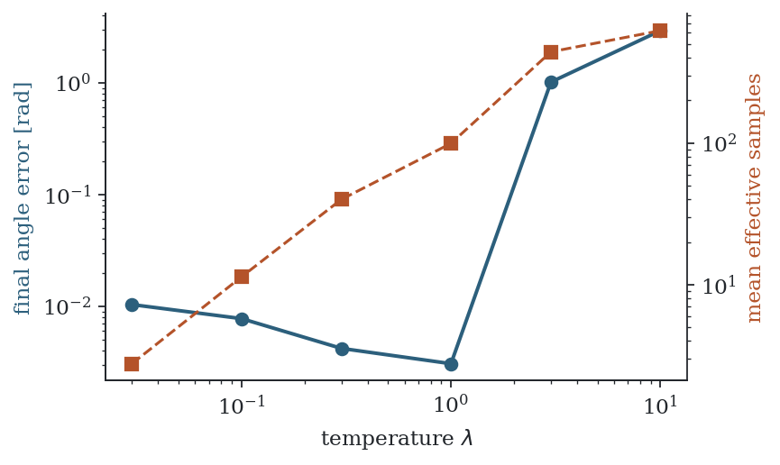

# 11. Tuning and practice

MPPI has four main parameters: the temperature $\lambda$, the noise covariance $\Sigma$, the horizon $T$ and the number of samples $K$. They interact, and most difficulties in practice trace back to one quantity, the effective sample size of Section 4.4. This chapter goes through the parameters using the pendulum of Chapter 9 as a test case. All numbers are averages over three random seeds from `code/pendulum.py`; "error" is the mean absolute angle from upright over the last two seconds of an eight-second run, and "chatter" is the mean absolute change in torque between consecutive steps over the same period. Effective sample sizes are averages over that period too, except in the temperature table, where they are averages over the whole run.

## 11.1 Monitor the effective sample size

Compute $K_{\mathrm{eff}} = 1/\sum_k w_k^2$ at every step and log it. It costs nothing and it is the single most informative diagnostic.

- If $K_{\mathrm{eff}}$ is close to 1, the update is the best sample and nothing else. The controller behaves like random search: it can still make progress, but the applied control jumps from step to step.
- If $K_{\mathrm{eff}}$ is close to $K$, all samples are weighted about equally, the weighted average of the noise is close to zero, and the controller barely changes its plan.
- A healthy value lies in between. Values from a few percent to a few tens of percent of $K$ are typical of working controllers.

## 11.2 Temperature

The temperature sets the cost difference that separates a good sample from a bad one. Since only $S/\lambda$ enters the weights, $\lambda$ must be chosen relative to the scale of the cost: multiplying the cost by ten and $\lambda$ by ten changes nothing except the implicit control cost.

*Final angle error (circles, left axis) and mean effective sample size (squares, right axis) as functions of the temperature, with the other parameters as in Chapter 9.*

| $\lambda$ | error [rad] | mean $K_{\mathrm{eff}}$ |
|---|---|---|
| 0.03 | 0.010 | 2.8 |
| 0.1 | 0.008 | 11 |
| 0.3 | 0.004 | 40 |
| 1 | 0.003 | 99 |
| 3 | 1.0 | 440 |
| 10 | 2.9 | 621 |

Lowering the temperature makes the weights more selective, and $K_{\mathrm{eff}}$ falls steadily. The task is still solved at $\lambda = 0.03$, but on fewer than three effective samples. Raising the temperature has an abrupt effect in this example: above $\lambda \approx 1$ the pendulum is no longer swung up at all. The reason is the implicit control cost $R = \lambda \Sigma^{-1}$ (Section 8.2). At high temperature, control effort is expensive relative to the state cost, and the optimal behaviour for the problem being solved is to leave the pendulum hanging. The algorithm is working correctly on a problem the user did not intend.

**Rule.** Choose $\lambda$ so that $K_{\mathrm{eff}}$ is a reasonable fraction of $K$, and remember that changing $\lambda$ with $\Sigma$ fixed also changes the control cost.

## 11.3 Noise covariance

The covariance determines how far from the nominal sequence the samples reach.

| noise variance | error [rad] | $K_{\mathrm{eff}}$ | chatter |
|---|---|---|---|
| 0.25 | 2.9 | 721 | 0.07 |
| 1 | 2.6 | 422 | 0.21 |
| 4 | 0.003 | 114 | 0.19 |
| 16 | 0.007 | 69 | 0.44 |

With small noise the samples are all similar, none of them discovers the swing-up, and the implicit control cost $\lambda/\sigma^2$ is high. With large noise the samples cover more, but they are spread thinly, and the applied control is rougher. The noise standard deviation should be comparable to the size of the control changes the task needs within one step: here a standard deviation of 2 against a torque limit of 5.

Because the control cost is $\lambda \Sigma^{-1}$, the ratio between $\lambda$ and $\Sigma$ sets how aggressive the controller is, and their overall scale sets how selective the weights are. Some implementations break this coupling by using an explicit control cost (Section 10.4), or by sampling with a covariance different from the one used in the cost.

## 11.4 Horizon

| horizon $T$ | error [rad] | $K_{\mathrm{eff}}$ | chatter |
|---|---|---|---|
| 10 (0.5 s) | 0.64 | 755 | 0.08 |
| 15 (0.75 s) | 0.002 | 555 | 0.11 |
| 25 (1.25 s) | 0.003 | 114 | 0.19 |
| 40 (2 s) | 0.028 | 1.8 | 2.8 |
| 60 (3 s) | 0.062 | 1.1 | 3.6 |

A horizon that is too short cannot see the benefit of swinging up. A horizon that is too long is harmful in a different way. Near the upright position the pendulum is unstable, so small differences in the noise grow exponentially along a rollout. Over two or three seconds the sampled trajectories diverge widely, their costs differ by much more than $\lambda$, and the weights collapse onto a single sample. The effective sample size drops below two and the torque chatters at more than half its limit.

This is the dimension effect of Sections 4.4 and 10.6, amplified by unstable dynamics. Remedies, in order of simplicity: shorten the horizon and improve the terminal cost so that a short horizon suffices; raise the temperature; sample around a stabilising feedback law, so that the rollouts do not diverge (Chapter 13).

## 11.5 Number of samples

| $K$ | error [rad] | $K_{\mathrm{eff}}$ | chatter |
|---|---|---|---|
| 10 | 0.05 | 1.3 | 3.6 |
| 30 | 0.40 | 1.6 | 2.7 |
| 100 | 0.47 | 2.7 | 2.1 |
| 300 | 0.018 | 10 | 1.0 |
| 1000 | 0.003 | 114 | 0.19 |
| 3000 | 0.002 | 391 | 0.13 |

With too few samples the result is erratic: the errors for $K = 10$, 30 and 100 vary strongly from seed to seed, and their ordering in the table is not meaningful. From a few hundred samples upward the controller is reliable, and more samples buy a smoother control signal. The required number grows with the dimension of the control sequence, $m \times T$, and with the difficulty of the task. There is no general formula; published systems use from a few hundred to tens of thousands.

## 11.6 Cost design

MPPI accepts any cost, including discontinuous ones, and this freedom is easy to misuse.

- **Scale.** Very large penalties, such as $10^6$ for a collision, make every colliding sample worthless, which is intended, but if all samples collide the weights depend on irrelevant differences. Penalties need only be large relative to $\lambda$ and to the other cost terms.
- **Shaping.** An indicator cost gives no information until a sample happens to satisfy it. A cost that decreases as the state approaches the goal lets partially successful samples guide the update.
- **Terminal cost.** As in all MPC (Section 3.3), a good terminal cost allows a short horizon, and a short horizon is what keeps the effective sample size up.

## 11.7 Smoothness

The update adds a weighted average of independent noise to each control, so consecutive controls receive unrelated corrections and the applied signal is jagged. The options are to filter the control sequence after the update, to sample noise that is correlated in time, or to let the sampled variable be the rate of change of the control so that the control is an integral of the noise. Each has published variants (Chapter 13).

## 11.8 Multimodal problems

When a task can be done in two distinct ways, such as passing an obstacle on either side, the optimal distribution has two modes and its mean may lie between them, in this case on a path into the obstacle. In practice warm starting usually commits the controller to one mode early, after which the samples concentrate there. Trouble arises in symmetric situations and when the preferred mode switches. Lower temperature and smaller noise make the controller commit; methods that represent several modes explicitly are listed in Chapter 13.

## 11.9 The model

MPPI optimises the model, not the system. If the model is wrong, the rollouts are wrong in the same way for all samples, and the receding horizon corrects only what one step of feedback can correct. Robust variants address this (Chapter 13). Independently of that, the model must be fast: the whole method rests on evaluating it $K \times T$ times per control step.

## 11.10 A procedure

1. Scale the cost so that typical differences between good and bad rollouts are of order 1 to 100.
2. Set the noise standard deviation to a sizeable fraction of the control range.
3. Choose the shortest horizon that can see the consequences that matter, and put the rest in the terminal cost.
4. Start with $\lambda$ equal to a typical cost difference and adjust until $K_{\mathrm{eff}}/K$ is between a few percent and a few tens of percent.
5. Increase $K$ until the behaviour stops changing between random seeds.
6. If the control is too rough, add smoothing before lowering the noise.

## 11.11 Summary

- Log the effective sample size; near 1 means weight collapse, near $K$ means no selection.
- The temperature sets selectivity, and together with $\Sigma$ it sets the implicit control cost $\lambda \Sigma^{-1}$.
- Long horizons and unstable dynamics spread the rollouts and collapse the weights.
- More samples reduce the roughness of the control and the variation between runs.
